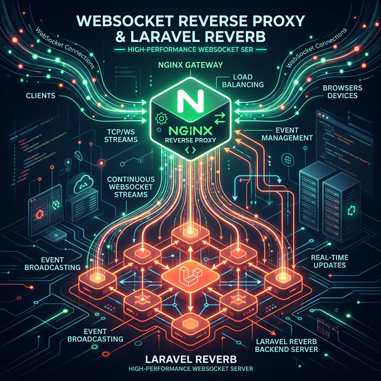

> **TL;DR:** Deploying Laravel Reverb behind Nginx requires configuring the proxy block to pass `Upgrade` and `Connection` headers. Internal `REVERB_HOST` must bind to `0.0.0.0`, while the client connects to the public domain via port `443`. In a double-proxy setup, *both* layers must pass these headers.

When building real-time features for production Laravel applications, deploying Laravel Reverb as your WebSocket server is the native choice. However, configuring the reverse proxy—especially in complex network topologies with multiple Nginx layers—is a common stumbling block that breaks the WebSocket handshake.

This tutorial walks through the exact setup needed to deploy Laravel Reverb in production, covering both standard single-server deployments and the separate proxy architecture.



## Architecture Overview

Laravel Reverb is a WebSocket server that enables real-time communication. In a production environment, the browser never connects directly to Reverb. Instead, Nginx acts as a reverse proxy.

There are two primary ways to architect this:

### 1. Single-Server Topology

Nginx and the Laravel application reside on the exact same machine. Nginx terminates SSL and proxies directly to the Reverb process.
`Browser (WSS/443) → Nginx (HTTPS :443) → Reverb (:8081)`

### 2. Separate Proxy Topology

This is common in enterprise environments where an external front-end proxy handles SSL and routes traffic to isolated backend application servers.

```text
Browser (WSS/443) → External Proxy (HTTPS :443)
                         ↓
                   App Server Nginx (:80)
                         ↓
                   Reverb (:8081)
```

> **Why does this work?** The browser connects to `wss://your-domain.com/app/{key}` on port `443` (HTTPS). Nginx intercepts the `/app` uri, upgrades the HTTP connection to a WebSocket connection, and forwards it to Reverb. The browser is completely unaware of Reverb's internal port.

## Prerequisites

To follow this deployment guide, ensure you have:

1. PHP >= 8.4 with the `pcntl` extension enabled.
2. Nginx and Supervisor (`apt-get install -y supervisor`) installed on your server(s).
3. A Laravel application deployed with the Reverb package installed (`composer require laravel/reverb`).

## Step 1: Configure Environment Variables

The most common point of failure when deploying Reverb is mixing up internal bind ports with external facing domains. You must configure two separate groups of variables in your `.env` file.

### Generate Unique Keys

Generate secure values for `REVERB_APP_ID`, `REVERB_APP_KEY`, and `REVERB_APP_SECRET`:

```bash
php -r "echo bin2hex(random_bytes(16));"
```

### The Configuration

```dotenv
# ─── Server-side: How Reverb binds internally ─────────────────────
BROADCAST_CONNECTION=reverb

REVERB_APP_ID=<your-unique-app-id>
REVERB_APP_KEY=<your-unique-app-key>
REVERB_APP_SECRET=<your-unique-app-secret>
REVERB_HOST="0.0.0.0"
REVERB_PORT=8081
REVERB_SCHEME=https

# ─── Client-side: How the browser connects ────────────────────────
VITE_REVERB_APP_KEY="${REVERB_APP_KEY}"
VITE_REVERB_HOST="your-domain.com"
VITE_REVERB_PORT=443
VITE_REVERB_SCHEME=https
```

### ❌ Bad Practice vs ✅ Best Practice

| Variable           | ✅ Correct Setup     | ❌ Bad Practice     | Why?                                                                                                        |
| :----------------- | :------------------ | :------------------ | :---------------------------------------------------------------------------------------------------------- |
| `REVERB_HOST`      | `"0.0.0.0"`         | `"your-domain.com"` | This is the background process bind address. Binding to a domain causes `php artisan reverb:start` to fail. |
| `VITE_REVERB_HOST` | `"your-domain.com"` | `"${REVERB_HOST}"`  | The browser cannot connect to `0.0.0.0`. It must be your public-facing domain.                              |

After configuring, explicitly cache the configuration:

```bash
php artisan config:cache
```

## Step 2: Set Up Supervisor

We need Supervisor to keep the WebSocket server running as a background daemon resilient to crashes.

Create a specific configuration file for your app (e.g., `/etc/supervisor/conf.d/laravel-reverb.conf`):

```ini
[program:laravel-reverb]
process_name=%(program_name)s
command=/usr/bin/php8.4 /var/www/your-app/artisan reverb:start --host=0.0.0.0 --port=8081
autostart=true
autorestart=true
stopasgroup=true
killasgroup=true
user=www-data
numprocs=1
redirect_stderr=true
stdout_logfile=/var/www/your-app/storage/logs/reverb.log
stdout_logfile_maxbytes=10MB
stdout_logfile_backups=5
```

Apply the changes:

```bash
supervisorctl reread
supervisorctl update
supervisorctl start laravel-reverb:*
```

Verify it binds to port `8081` successfully:

```bash
ss -tlnp | grep 8081
```

## Step 3: Configure Nginx Architecture

Laravel Reverb expects WebSocket connections at `/app/{your-app-key}`. The browser will negotiate WSS on port `443`, and Nginx must appropriately upgrade the HTTP connection and proxy it.

### Option A: Single-Server Setup

If Nginx and the Laravel app are on the **same machine**, define the `/app` location block **before** your main `/` block.

```nginx
server {
    listen 80;
    server_name your-domain.com;
    return 301 https://$host$request_uri;
}

server {
    listen 443 ssl;
    server_name your-domain.com;

    ssl_certificate     /etc/ssl/certs/your-domain.crt;
    ssl_certificate_key /etc/ssl/private/your-domain.key;

    root /var/www/your-app/public;
    index index.php;

    # ── Reverb WebSocket proxy (MUST be before "location /") ──
    location /app {
        proxy_http_version 1.1;
        proxy_set_header Host $http_host;
        proxy_set_header Scheme $scheme;
        proxy_set_header SERVER_PORT $server_port;
        proxy_set_header REMOTE_ADDR $remote_addr;
        proxy_set_header X-Forwarded-For $proxy_add_x_forwarded_for;
        proxy_set_header Upgrade $http_upgrade;
        proxy_set_header Connection "Upgrade";
        proxy_pass http://127.0.0.1:8081;

        proxy_read_timeout 60s;
        proxy_send_timeout 60s;
    }

    # ── Laravel application ──
    location / {
        try_files $uri $uri/ /index.php?$query_string;
    }

    # ... standard PHP block
}
```

### Option B: Separate Proxy Setup (Two Nginx Layers)

If you have an external proxy handling SSL that forwards to a backend app server, **both** Nginx configs need the WebSocket `/app` block. If the outer proxy doesn't send the `Upgrade` header, the inner proxy will reject the request.

#### 1. External Proxy Nginx Configuration

```nginx
server {
    listen 80;
    server_name your-domain.com;
    include /etc/nginx/snippets/ssl_common.conf;

    # ── Reverb WebSocket Proxy ──
    location /app {
        proxy_http_version 1.1;
        proxy_set_header Host $http_host;
        proxy_set_header Upgrade $http_upgrade;
        proxy_set_header Connection "Upgrade";
        proxy_set_header X-Forwarded-For $proxy_add_x_forwarded_for;
        proxy_pass http://10.0.0.122; # Internal App Server IP

        proxy_read_timeout 60s;
        proxy_send_timeout 60s;
    }

    # ── Standard App Traffic ──
    location / {
        include /etc/nginx/snippets/proxy_common.conf;
        proxy_pass http://10.0.0.122;
    }
}
```

#### 2. App Server Nginx Configuration (Backend)

```nginx
server {
    listen 80;
    server_name your-domain.com;
    root /var/www/your-app/public;

    # ── Reverb WebSocket Proxy ──
    location /app {
        proxy_http_version 1.1;
        proxy_set_header Host $http_host;
        proxy_set_header Scheme $scheme;
        proxy_set_header SERVER_PORT $server_port;
        proxy_set_header REMOTE_ADDR $remote_addr;
        proxy_set_header X-Forwarded-For $proxy_add_x_forwarded_for;
        # Crucial: Upgrade headers must be repeated on the backend server
        proxy_set_header Upgrade $http_upgrade;
        proxy_set_header Connection "Upgrade";
        proxy_pass http://127.0.0.1:8081;

        proxy_read_timeout 60s;
        proxy_send_timeout 60s;
    }

    location / {
        try_files $uri $uri/ /index.php?$query_string;
    }
}
```

Reload Nginx after modifying configs:

```bash
nginx -t && systemctl reload nginx
```

## Step 4: Verification Workflow

Follow this inside-out methodology to isolate connection issues.

### 4.1 Test Reverb Directly (App Server)

First, verify internal process networking is working natively:

```bash
curl -i --max-time 5 \
  -H "Connection: Upgrade" \
  -H "Upgrade: websocket" \
  -H "Sec-WebSocket-Version: 13" \
  -H "Sec-WebSocket-Key: dGhlIHNhbXBsZSBub25jZQ==" \
  http://127.0.0.1:8081/app/<your-reverb-app-key>
```

**Expected:** `HTTP/1.1 101 Switching Protocols`

### 4.2 Test Nginx App Server Proxy

Ensure the internal Nginx node successfully upgrades the connection:

```bash
curl -i --max-time 5 \
  -H "Host: your-domain.com" \
  -H "Connection: Upgrade" \
  -H "Upgrade: websocket" \
  -H "Sec-WebSocket-Version: 13" \
  -H "Sec-WebSocket-Key: dGhlIHNhbXBsZSBub25jZQ==" \
  http://127.0.0.1/app/<your-reverb-app-key>
```

**Expected:** `HTTP/1.1 101 Switching Protocols`

### 4.3 End-to-End Browser Check

Execute this in your browser's DevTools console against the public domain:

```javascript
const ws = new WebSocket('wss://your-domain.com/app/<your-reverb-app-key>?protocol=7&client=js&version=8.4.0&flash=false');

ws.onopen = () => console.log('✅ Connected!');
ws.onmessage = (e) => console.log('📩 Received:', JSON.parse(e.data));
```

## Troubleshooting

If you hit a wall, consult these frequently encountered errors from deployment lifecycles:

| Error                         | Root Cause                                      | Solution                                                                                  |
| :---------------------------- | :---------------------------------------------- | :---------------------------------------------------------------------------------------- |
| **500 Internal Server Error** | Missing HTTP upgrade headers bridging nodes     | Ensure both Nginx boxes set `Upgrade $http_upgrade;` and `Connection "Upgrade";`.         |
| **Connection Timeout**        | Incorrect `.env` variables injected to frontend | Check if `VITE_REVERB_PORT` explicitly maps back to `443` and not `8081`.                 |
| **Connection Refused**        | Background Reverb loop crashed or hung          | Check `lsof -i :8081`, kill the orphan PID, and `supervisorctl restart laravel-reverb:*`. |

Checking Reverb's background logs is crucial when establishing your payload patterns:

```bash
tail -f /var/www/your-app/storage/logs/reverb.log
```
