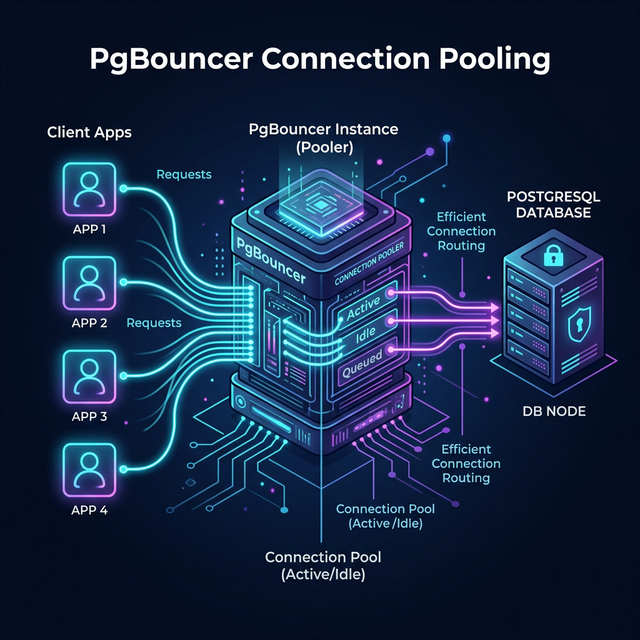

> **TL;DR**
> `PgBouncer` is a crucial middleware for scaling PostgreSQL, but choosing the right pooling mode makes or breaks your database concurrency. **Transaction mode** is the gold standard for high-traffic frameworks like Laravel as it releases connections instantly after a query, whereas **session mode** ties up database connections for the entire lifecycle of a client connection, limiting maximum throughput.



## The Connection Exhaustion Problem

In modern stateless web applications built on top of Laravel, standard PHP deployments establish a new database connection for every single HTTP request. This constant connection churn hits PostgreSQL hard, rapidly depleting its `max_connections` limit and triggering sudden `FATAL: sorry, too many clients already` errors during high traffic.

Since PostgreSQL forks a new OS process for each connection, high connection counts directly consume enormous amounts of memory. To solve this, developers deploy **PgBouncer**, a lightweight connection pooler. But simply installing PgBouncer isn’t enough—you must configure the correct pooling mode based on your application's architecture to actually unlock performance.

## Comparing Session vs. Transaction Mode

PgBouncer operates primarily in two modes relevant to web applications:

| Feature Dimension | Session Mode (`pool_mode = session`) | Transaction Mode (`pool_mode = transaction`) |
| :--- | :--- | :--- |
| **Connection Release Trigger** | Client disconnects completely | Server `COMMIT` or `ROLLBACK` |
| **Concurrency Ceiling** | Low (Tied to active application clients) | Extremely High (Multiplexes 10x-100x clients) |
| **Session-Level State** (`SET`) | Fully retains session states natively | Cannot reliably retain session variables |
| **Temporary Tables / Advisory Locks** | Fully supported across queries | Not supported across transactions |
| **Prepared Statement Support** | Natively supported | Supported transparently (PgBouncer v1.21+) |
| **Laravel Compatibility** | Okay, but limits scaling | **Highly Recommended** for max throughput |

## Recommendation Per Use Case

### When to use Session Mode

Session pooling acts exactly like a direct PostgreSQL connection. A server connection is leased to a client application logic from the moment it connects until the exact second it disconnects.

*   **Legacy Applications:** Best for monolithic apps written with heavy reliance on PostgreSQL `SESSION`-level variables, `LISTEN`/`NOTIFY`, and temporary tables.
*   **Long-Running Tasks:** Ideal for heavy scheduled reporting jobs or data warehousing queries.
*   **But for Laravel:** You lose multiplexing benefits. If your web app scales up to 500 concurrent PHP-FPM workers, session mode still requires 500 active PgBouncer-to-PostgreSQL backend connections, eventually crashing your database.

### When to use Transaction Mode (The Best Practice)

Transaction pooling is the hero of modern web scaling. A server connection is only leased to the client for the microsecond duration of a `BEGIN ... COMMIT` block. Once the transaction resolves, the backend connection is immediately returned to the pool for another client to use.

*   **Laravel/PHP Apps:** Highly recommended. A pool of just 50 background database connections can easily serve 5,000+ stateless web clients.
*   **Microservices:** Perfect for architectures with frequent, short, and discrete database queries.
*   **State limitations:** Use `SET LOCAL` scoped within your transaction instead of global `SET` commands, as consecutive transactions from the same client might be routed to completely different backend connections.

## Configuration Code Snippets

Here's how to properly configure PgBouncer in your `pgbouncer.ini` configuration.

### Bad Practice

```ini
# Bad Practice: Using session mode for a highly concurrent web application
[bases]
postgres = host=127.0.0.1 port=5432 dbname=webapp_db

[pgbouncer]
listen_port = 6432
listen_addr = 127.0.0.1
auth_type = md5
auth_file = userlist.txt

# This limits concurrency to exactly what your database can handle natively
pool_mode = session
max_client_conn = 100
default_pool_size = 20
```

### Best Practice

```ini
# Best Practice: Transaction mode multiplexing paired with prepared statement support
[bases]
postgres = host=127.0.0.1 port=5432 dbname=webapp_db

[pgbouncer]
listen_port = 6432
listen_addr = 127.0.0.1
auth_type = md5
auth_file = userlist.txt

# Transaction mode allows massive connection multiplexing
pool_mode = transaction

# You can accept thousands of application connections
max_client_conn = 5000

# While only maintaining a small, efficient pool to the actual database
default_pool_size = 50

# Enable prepared statement tracking for high performance (PgBouncer 1.21+)
max_prepared_statements = 100
```
